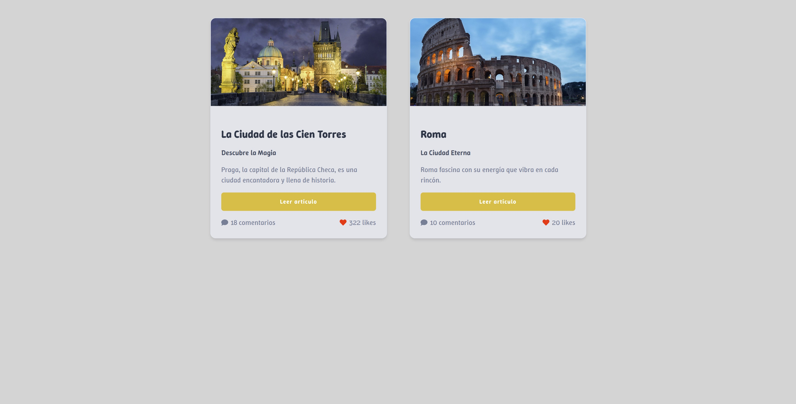

# 🌆 City Cards - Proyecto con React

Este proyecto es una aplicación simple en React que muestra tarjetas de ciudades (CityCard) con título, descripción, imagen y estadísticas (comentarios y likes). Cada tarjeta es un componente reutilizable.

## ✨ Funcionalidades

- Tarjetas reutilizables para diferentes ciudades.
- Diseño responsivo.
- Estilizado con CSS y React Icons.
- Cambio de fondo de página.
- Uso de `props` para personalizar contenido.
- Preparado para escalar y añadir más ciudades fácilmente.

## 🛠 Tecnologías usadas

- React
- CSS
- React Icons
- Google Fonts

## 📸 Captura de pantalla



## 🚀 Cómo correr el proyecto

1. Clona este repositorio

```bash
git clone https://github.com/tu-usuario/tu-repo.git
```
